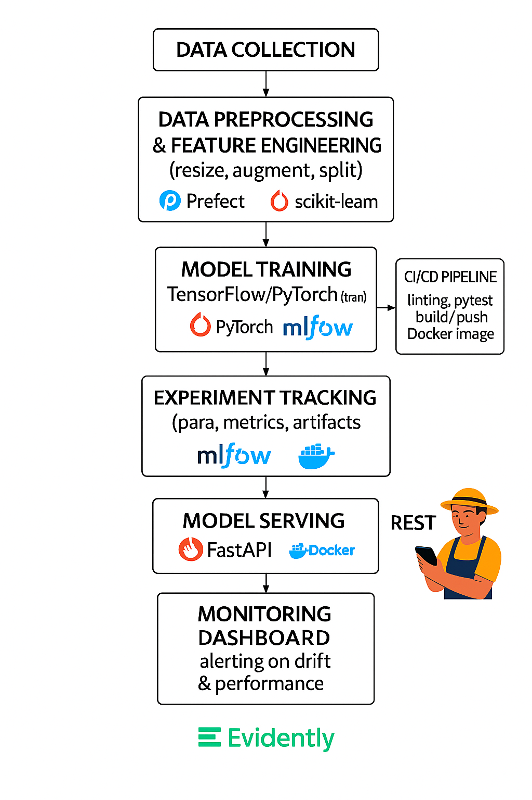

<!-- Logo/banner at top -->
<p align="center">
  
</p>

# 🌿 Plant Disease API

<!-- Badges below title -->
<p align="center">
  <a href="https://huggingface.co/spaces/mcherif/Plant-Disease-Classifier">
    
  </a>
  <a href="https://github.com/mcherif/plant-disease-mlops/actions">
    
  </a>
  <a href="https://github.com/mcherif/plant-disease-mlops/blob/main/LICENSE">
    
  </a>
</p>


# How to Run the Streamlit App with Docker

To build and run the Streamlit app using Docker:

```bash
docker build -t plant-app .
docker run -p 8501:8501 plant-app
```

Then open [http://localhost:8501](http://localhost:8501) in your browser to use the app.

# Run FastAPI app instead:
```bash
docker run -p 8000:8000 plant-app uvicorn src.inference.app_fastapi:app --host 0.0.0.0 --port 8000
```

# Outline
This project fine-tunes a Vision Transformer (ViT) model to classify plant leaf diseases using the PlantVillage dataset. It integrates modern MLOps tools for training, evaluation, reproducibility, and automation.
A FastAPI-based plant disease detection service is added, and **Model accuracy:** 97.2% on the PlantVillage test set.

## 🚀 Features

- Vision Transformer (ViT) fine-tuning with Hugging Face Transformers
- PyTorch + torchvision training pipeline
- MLflow for experiment tracking
- Prefect for orchestration
- Docker containerization
- GitHub Actions CI with Ruff + Pytest

---

### 🧭 Project Architecture

The architecture diagram below illustrates the full MLOps workflow, from data ingestion and training to deployment, serving, and monitoring. A mobile app integration may be explored in future iterations.




## ⚙️ Setup Instructions

### 💻 Local Development (with GPU support)

If you're developing locally and want to use a CUDA-optimized version of PyTorch:

```bash
pip install -r requirements-dev.txt
```

This will:

- Install all core dependencies from `requirements.txt`
- Enable CUDA support via `torch==2.1.0+cu118` (via `--extra-index-url`)
- Install development tools like `pytest`, `ruff`, and `pylint`

> ⚠️ Make sure your GPU and CUDA toolkit are compatible with this version of PyTorch. Visit [PyTorch installation guide](https://pytorch.org/get-started/locally/) if unsure.

---

## 🧹 Linting & Code Quality

This project uses **GitHub Actions** for Continuous Integration (CI) to automate quality checks and ensure consistent, production-ready code. 

CI tasks include:

✅ **Fast code linting with `ruff`**  
Runs on every push or pull request. It checks for PEP8 compliance and can auto-fix issues:

```bash
ruff check . --fix
```

✅ **Running tests with `pytest`**  
Ensures that core functionality behaves as expected.

✅ **(Optional) Docker image build**  
Verifies that the app builds correctly in a containerized environment.

We also use `pylint` locally for deeper static analysis and complexity checks.
You should run it manually before major commits:

```bash
pylint src/
```

This dual approach gives us both speed (CI) and depth (manual analysis). 💪

### File structure
```
plant-disease-classifier/
├── data/                        # Raw and processed datasets
├── notebooks/                   # Jupyter notebooks for EDA & dev
├── src/                         # All source code
│   ├── preprocessing/           # Image loaders, augmentation, resizers
│   ├── training/                # Model training code
│   ├── inference/               # FastAPI & prediction utils
│   └── monitoring/              # Drift detection, logging
├── flows/
│   └── prefect_flow.py          # Main Prefect pipeline definition
├── models/                      # Saved models (optional if MLflow used)
├── tests/                       # Pytest files for unit/integration testing
├── Dockerfile                   # App Docker build instructions
├── docker-compose.yaml          # Service orchestration: app, MLflow, monitoring
├── requirements.txt             # Python dependencies for CI or production
├── requirements-dev.txt         # Python dependencies for development
├── mlruns/                      # Local MLflow tracking artifacts
├── README.md                    # Project overview and instructions
└── .gitignore                   # Files and folders to ignore in version control
```

### 🛠️ Project Tool Breakdown

| **Module**            | **Zoomcamp Tools**                 | **Description**                                                                |
|-----------------------|------------------------------------|---------------------------------------------------------------------------------|
| Data/Training Pipeline| Prefect, Docker, MLflow            | Automate data ingestion, augmentation, training with MLflow tracking & registry |
| CI/CD                 | GitHub Actions                     | Run linting, tests, and trigger flows automatically                             |
| Model Serving         | FastAPI, Docker, MLflow            | Containerized inference API with models loaded from MLflow registry             |
| Deployment            | Docker Compose / Terraform         | Deploy app, Prefect agents, and serving endpoint using infra-as-code            |
| Monitoring            | Evidently, Prometheus, Grafana     | Track data/prediction drift and log model metrics                               |
| Retraining Trigger    | Prefect, Alerts (custom logic)     | Trigger retraining when drift or performance drops detected                     |
| E2E Tests             | pytest, integration tests          | Test end-to-end pipeline from ingestion to prediction                           |


### 📁 Script Overview

| Script                | Purpose                                      | Usage Context                  | Runs MLflow? | CI-Safe? | Prefect Required |
|------------------------|----------------------------------------------|--------------------------------|--------------|----------|------------------|
| `prefect_flow.py`      | Full pipeline: data → train → evaluate       | Production runs, automation    | ✅ Yes       | ✅ Yes*  | ✅ Yes           |
| `train_vit.py`         | Train ViT model with MLflow logging          | Fast local iteration, dev work | ✅ Yes       | ⚠️ No\*  | ❌ No            |
| `evaluate_test.py`     | Load + evaluate model, log metrics           | CI/CD model sanity checks      | ✅ Yes       | ✅ Yes   | ❌ No            |
| `demo_inference.ipynb` | Interactive inference on single/test images  | Local testing, model demos     | ❌ No        | ✅ Yes   | ❌ No            |

> \* Not CI-safe by default unless model files are present or test skipping is used.


## ▶️ Running the Prefect Flow

The main pipeline is orchestrated by `flows/prefect_flow.py`. You can control whether to run the training step by using the `--do_training` argument.

### Run Full Pipeline (with Training)

```bash
python flows/prefect_flow.py --do_training=true
```

This will execute all steps: data ingestion, preprocessing, model training, evaluation, and artifact logging.

### Run Pipeline (Skip Training)

```bash
python flows/prefect_flow.py --do_training=false
```


> **Tip:**

Make sure your MLflow server is running before you start the flow, from the root folder run the below:
```bash
mlflow server --backend-store-uri sqlite:///mlflow.db --default-artifact-root ./mlruns --host 0.0.0.0 --port 5000
```

Your Python environment should have all dependencies installed (see requirements.txt).

## 🏃‍♂️ How to Run the Pipeline

### 1. Install Dependencies

**Recommended:** Use a virtual environment (venv, conda, etc.)

```bash
python -m venv .venv
.venv\Scripts\activate  # On Windows
# or
source .venv/bin/activate  # On Linux/Mac
pip install -r requirements.txt
```

For GPU support (CUDA):
```bash
pip install -r requirements-dev.txt
```

### 2. Start MLflow Tracking Server

From the project root:
```bash
mlflow server --backend-store-uri sqlite:///mlflow.db --default-artifact-root ./mlruns --host 0.0.0.0 --port 5000
```

### 3. Run the Prefect Pipeline

**With training:**
```bash
python flows/prefect_flow.py --do_training=true
```

**Skip training (use existing model):**
```bash
python flows/prefect_flow.py --do_training=false
```

Artifacts (metrics, confusion matrix, classification report) will be saved in the `artifacts/` folder and logged to MLflow.

### 4. Monitor Results
- View MLflow UI at: http://localhost:5000
- Check `artifacts/` for evaluation outputs.

---

## 📦 Dependency Versions

All dependencies are pinned in `requirements.txt` and `requirements-dev.txt`.

**Key versions:**
- Python >= 3.10
- torch==2.1.0 (CPU, for CI)
- torch==2.1.0+cu118 (GPU, for dev)
- torchvision==0.16.0
- transformers==4.38.2
- mlflow==3.1.1
- prefect==2.14.12
- scikit-learn==1.7.0
- pandas==2.3.0
- matplotlib==3.10.3

See the full list in `requirements.txt`.

---

## 🚦 Model Inference API (FastAPI)

You can serve the trained model as a REST API using FastAPI. The API supports image upload and returns the predicted class and confidence.

### 1. Start the FastAPI Server

From the project root, run:

```powershell
uvicorn src.inference.app:app --host 0.0.0.0 --port 7860
```

If port 7860 is busy, you can also run:

```powershell
uvicorn src.inference.app:app --host 0.0.0.0 --port 8000
```

> **Note:** On Hugging Face Spaces, the app must run on port 7860.

### 2. Test the API

#### Health Check (GET)
Open your browser or run:
```powershell
curl http://localhost:8000/
```

#### Predict Endpoint (POST)
You can use Python or PowerShell to send an image for prediction.

**Python example:**
```python
import requests

url = "http://localhost:8000/predict/"
with open("path_to_your_plant_image.jpg", "rb") as f:  # Replace with your image path
    files = {"file": f}
    response = requests.post(url, files=files)
print(response.json())
```

**PowerShell example:**
```powershell
Invoke-RestMethod -Uri "http://localhost:8000/predict/" -Method Post -Form @{file=Get-Item "path_to_your_plant_image.jpg"}
```

- Replace `path_to_your_plant_image.jpg` with the path to any plant image you want to classify.
- You can also use the interactive Swagger UI at [http://localhost:8000/docs](http://localhost:8000/docs) to upload an image and test the API.

---

## 🥒 Example: Test the /predict Endpoint (Docker)

After running your Docker container:

### Using curl (PowerShell)
```powershell
curl -X POST "http://localhost:8000/predict/" -H  "accept: application/json" -H  "Content-Type: multipart/form-data" -F "file=@example.jpg;type=image/jpeg"
```
Replace `example.jpg` with the path to your test image.

### Using Swagger UI
Open [http://localhost:8000/docs](http://localhost:8000/docs) in your browser, expand the `/predict/` endpoint, and upload an image file to test.

---

## 🐳 Docker: Build & Run the Inference API

> **Note:** Do **not** upload large Docker images to GitHub. Instead, share your Dockerfile and instructions so others can build the image themselves.

### 1. Build the Docker Image
From the project root, run:
```powershell
docker build --no-cache -t plant-disease-classifier-prod .
```

### 2. Run the Docker Container
To start the FastAPI server and expose it on port 8000:
```powershell
docker run -it --rm -p 8000:8000 plant-disease-classifier-prod
```
If port 8000 is busy, use another port (e.g., 8001):
```powershell
docker run -it --rm -p 8001:8000 plant-disease-classifier-prod
```

### 3. Test the API
- Open [http://localhost:8000/docs](http://localhost:8000/docs) for Swagger UI.
- Or use curl/PowerShell as shown above to test `/predict/`.

---

## 📦 Large File Support (Git LFS)

This project uses [Git Large File Storage (LFS)](https://git-lfs.github.com/) to track large model files (such as `model.safetensors`).

**Before cloning or pulling the repository, install Git LFS:**
```bash
git lfs install
```

If you have already cloned the repository and are missing large files, run:
```bash
git lfs pull
```

This ensures that all required model files are downloaded correctly for local development and deployment.

---

## 🆘 Troubleshooting
- If you see CUDA errors, check your PyTorch and CUDA versions.
- If MLflow UI does not show runs, ensure you are logging to the correct tracking URI.
- For Windows, use the provided `requirements-dev.txt` for compatibility.